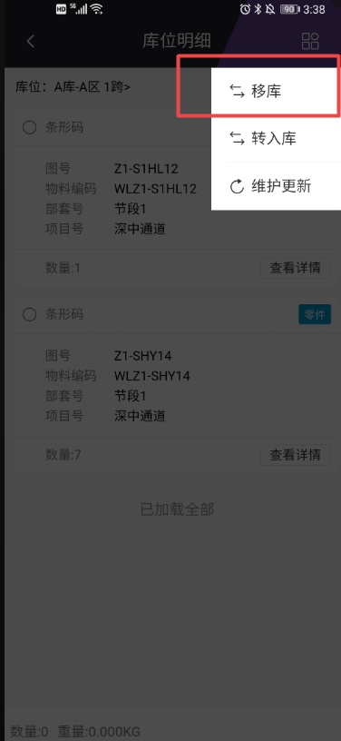
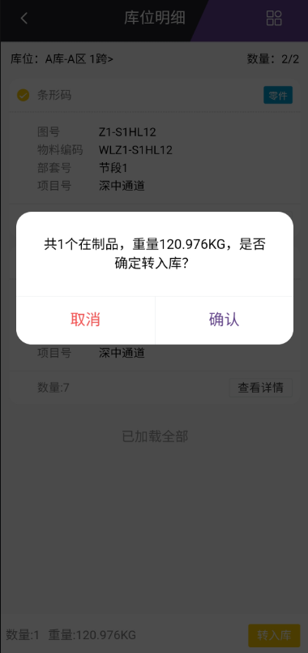
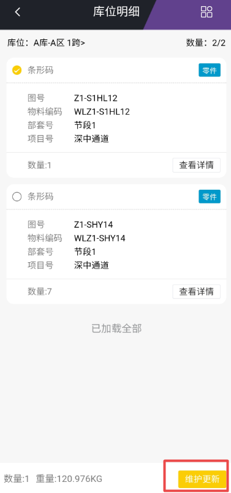

# 在制品线边库
功能说明：
   查看已经到达在制品线边库的在制品，并对其进行移库、转入库等操作。
操作说明：
   【移库】：进入库位明细后，点击右上角的操作选项，点击移库。选择需要移库的数据后点击右下方的移库按钮，选择库位后点击确认即可完成移库操作。

   【转入库】：进入库位明细后，点击右上角的操作选项，点击转入库。选择需要转入库的数据后点击右下放的转入库按钮，然后点击确认按钮即可完成转入库操作。成功后，数据进入半成品入库页面。

   【维护更新】：进入库位明细后，点击右上角的操作选项，点击维护更新。选择需要维护更新数据后点击右下方的维护更新按钮，修改完相关的信息后点击保存即可完成维护更新。

