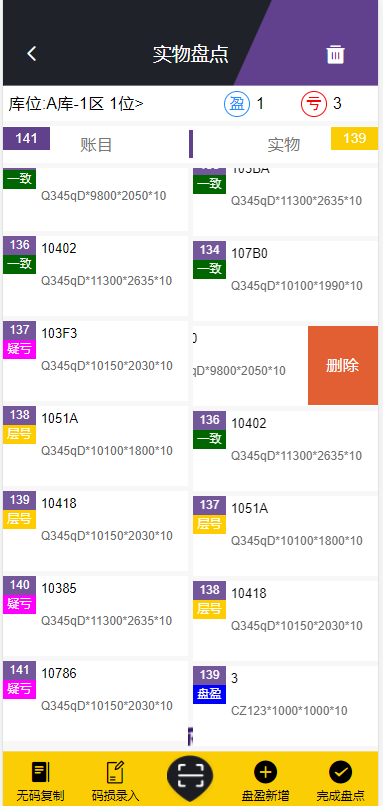
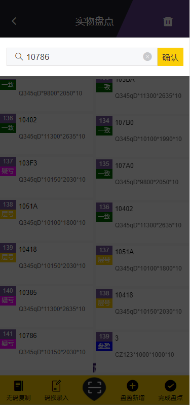
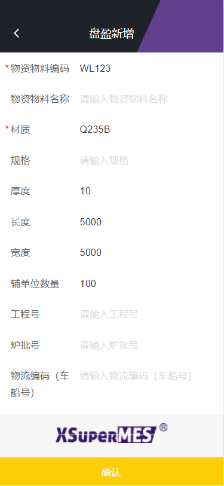

# 库存盘点
功能说明：

   对各库房进行盘点，并查看实时盘点结果。

操作说明：

  【发起盘点】：点击发起盘点按钮，会弹出了选择盘点的页面。
按全库盘点，则是所有的原材料库的库位都加入盘点。
按库房盘点，可以选择你需要盘点的库房，但是只能单选。
按库位盘点，可以选择需要盘点的库位进行盘点，但是只能选择一个库房下的库位。

  【编辑盘点单】：只有按库位发起的盘点才能编辑，可以编辑选择的库位。

  【结束盘点】：对发起的盘点单进行结束操作，结束后，相应的库房、库位会被释放掉。

  【进入盘点】：点击进入盘点按钮，页面会进入具体的盘点页面。右滑可以删除实物，也可以点击右上角的删除
按钮进行批量删除实物。钢板上的状态，一致：账目与实物一致；疑亏：账目有但是实物没有；层号：账目与实物的层号不一致；库位：实物存在别的库位中。

  【无码复制】：可以将左侧的账目数据批量复制到右侧实物栏中。

  【码损录入】：钢板上的条码损坏时，可以输入条码点击确认，钢板会录入到实物中。码没有损坏时，也可以扫码录入。
  

 
 

  【盘盈新增】：点击盘盈新增，可以录入盘盈的钢板信息。
  

 
 

 【完成盘点】：更新库位盘点状态从盘点中到已盘点。更新头部盈亏数据，盘盈的数量和，盘亏的数量和，更新库位盘点结果。

 