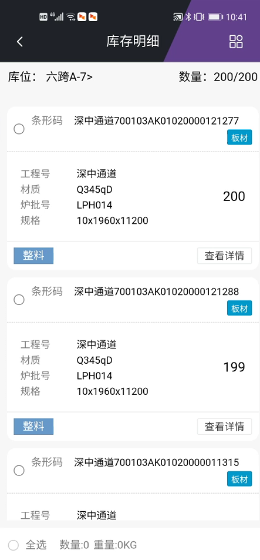
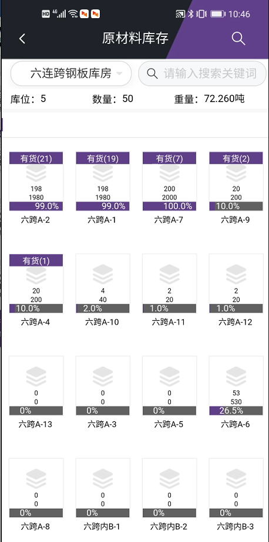
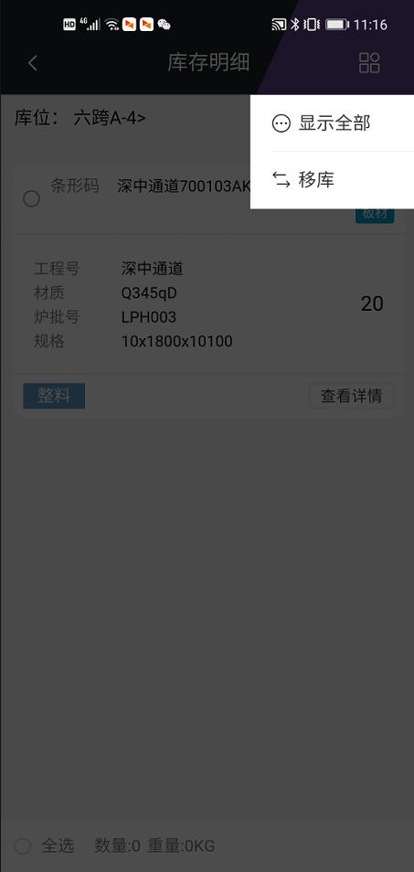
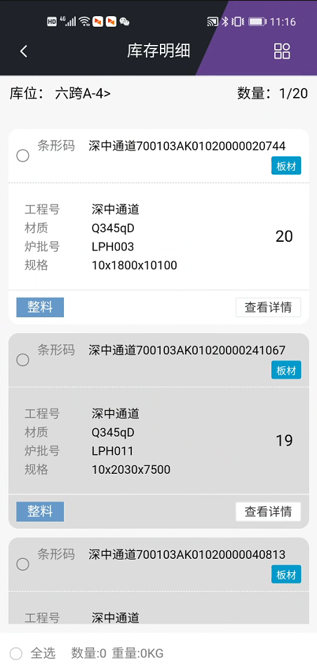

# 原材料库存
功能说明：
   用于展示以及操作库存现有原材料。
操作说明：
   进入原材料库存查看库存情况，单击库位进入库位明细查看。

支持检索查询满足条件的原材料，“有货”代表这个库位里面有物资，“有货”后的“数量”代表该库位里面的数量值。上侧库位代表一共有几个库位有货，数量代表一共满足条件的多少张，重量代表一共满足条件的多少吨。

进入库位默认显示满足条件的原材料，可以通过点击全部展示所有原材料。满足条件的高亮，不满足条件的暗底。

