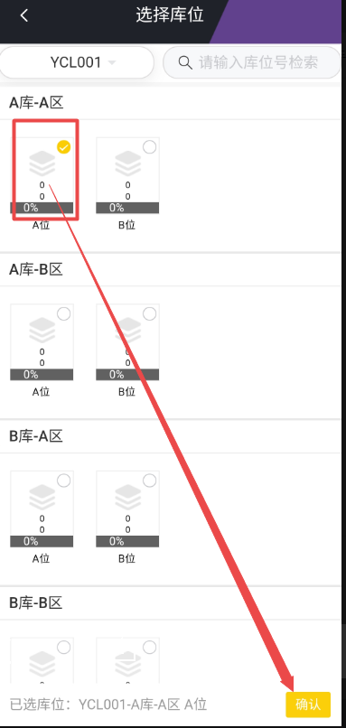

# 余料出库
功能说明：

   用于根据领料单需求进行余料的出库。

操作说明：

   【出库】：选择需要出库的余料，点击出库按钮。弹出选择库房、库位的按钮后，点击确认完成
出库。

   【移库】：选择需要出库的余料，点击出库按钮。弹出选择库房、库位的按钮后，点击确认完成
出库。 

  会弹出该出库单所用余料所在库位的全部余料，再勾选需要移库的余料点击移库。弹出选择库房、库位页面后，选择库位完成移库。

